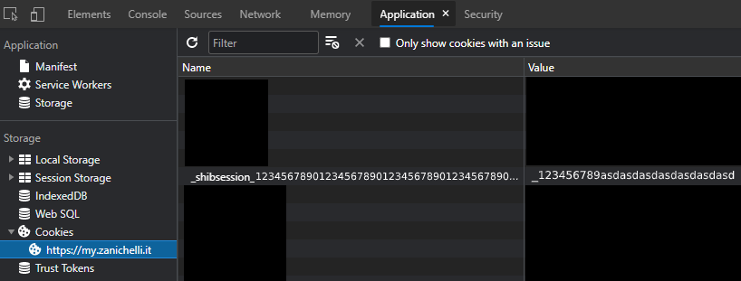

# booktab-downloader

A python script to download you Zanichelli books from web Booktab as PDFs

## How to use

1. Download this repo, unzip the download, open a terminal, navigate to the extracted files and type:

    ```bash
    pip install -r requirements.txt
    ```

2. Run the script with python3
3. Open [Booktab Web](http://web.booktab.it/) and login
4. Open the developers tool, go in the "application" tab and navigate to:

    ```bash
    Storage > Cookies > web.booktab.it
    ```

    Then, look for a cookie that has "shibsession" in its name, copy its value, paste it into the terminal and press enter.

    
5. Take the ISBN of the book you'd like to download, paste it into the terminal and press enter.
6. The script will now begin downloading the book, the amount of time it takes to do everything depends on your internet speed.
7. After the download is done it will ask for a file name, write the name of the book and press enter
8. Now you have a .pdf in the same directory of the script, enjoy!

## Disclaimer

Remember that you are responsible for what you are doing on the internet and even tho this script exists it might not be legal in your country to create personal backups of books.

I may or may not update this script depending on my needs, but I'm open to pull requests ecc.

## License

This software uses the MIT License
